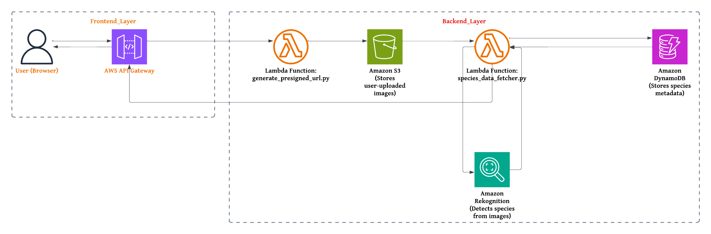

# 🐾 Wildlife Detector 

**Empowering Every Explorer with Wildlife Knowledge**  
Wildlife Detector is an AI-powered web app that lets people upload pictures of wildlife and get instant information about the species in the image. It uses Amazon Rekognition and species data from iNaturalist to identify animals and show details like scientific name, habitat, and fun facts — all in a clean, interactive interface.

This project is for:

Nature lovers, hikers, and explorers who often spot animals on trails and want to learn more about them

Students or educators who want a simple tool to identify wildlife and teach biodiversity

Anyone curious about the animals they encounter - just snap a photo and learn something cool


### Note: This project was built as a hands-on way to explore AWS services like S3, Lambda, API Gateway, and Rekognition. While the UI is responsive and offline functionality is planned, the current version focuses on the backend integration and image-based species recognition pipeline using cloud-native tools.

---

## Key Features
- **Upload Wildlife Images** – Identify wild species via simple image upload.
- **AI-powered Species Detection** – Images are analyzed using Amazon Rekognition & iNaturalist API.
- **Dynamic Species Cards** – Interactive design with hover animations.
- **React.js & TailwindCSS** – Modern, responsive, and highly optimized frontend.
- **Responsive UI** – Built with React.js & Tailwind CSS.
- **Species Info Display** – Provides details like scientific name, habitat, conservation status, and fun facts.

---

## Tech Stack
- **Frontend:** React.js,[TailwindCSS](https://tailwindcss.com/)
- **Animations:** [Framer Motion](https://www.framer.com/motion/)
- **API Integration:** AWS Lambda, API Gateway, Amazon Rekognition, iNaturalist

---

## 📂 Project Structure & Architecture
```
WILDLIFE-DETECTOR/
├── Backend/                   # Lambda function code (for reference)
├── Frontend/                 
│   ├── src/                  
│   │   └── components/       # Upload, result cards, detail views
│   └── public/               
├── demo.gif                  # Demo video (GIF)
├── README.md                 
```


---

## 🛠️ Installation & Setup
Follow these steps to set up the project locally:

### Clone the Repository
```sh
git clone https://github.com/your-username/wildlife-detector-frontend.git
cd wildlife-detector-frontend
```

### Install Dependencies
```sh
npm install
```
#### Environment Variables

Create a `.env` file inside the `Frontend/` folder using the structure below:

```env
REACT_APP_API_BASE_URL=https://your-api-id.execute-api.us-east-1.amazonaws.com/prd

### Start the Development Server
```sh
npm run dev
```
🔹 Open **`http://localhost:3000`** in your browser.

---

##  API Integration
The frontend interacts with the backend via AWS API Gateway endpoints.

---

##  Screenshots
###  **Landing Page**


###  **Upload & Species Detection**


###  **Species Info & Cards**


---

##  Contributing
Want to help improve this project? Follow these steps:
1. **Fork** this repo.
2. Create a **new branch** (`feature/new-animation`).
3. **Commit** your changes (`git commit -m "Added animation effect"`).
4. **Push** to GitHub (`git push origin feature/new-animation`).
5. **Create a Pull Request** 


---

- **Developed by:** [Reeya Gupta](https://github.com/reeya123)

---

 **Love this project?** Please consider starring it on GitHub! It helps others discover it and shows your support 

